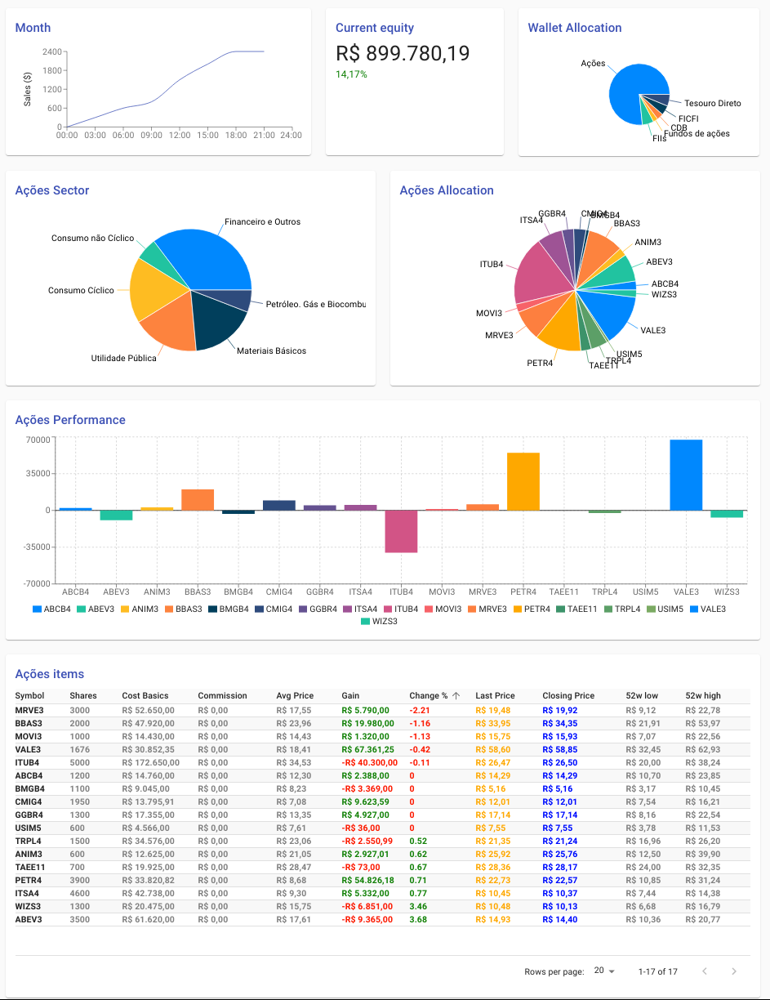

# Finance Wallet Frontend



## Dependencies

- nodejs
- yarn
- [Finance Wallet API][finance-api]
  - via docker compose: `make docker-run`

### Installing dependencies

```bash
make setup
```

## Run it

```bash
make run
```

## Third Party

Favicon uses a picture from [icon-library.com][icon-library]
licensed under [CC0 Public Domain Licence][cco].

[icon-library]: http://icon-library.com/icon/icon-finance-15.html
[cco]: https://creativecommons.org/share-your-work/public-domain/cc0/
[finance-api]: https://github.com/mfinancecombr/finance-wallet-api
